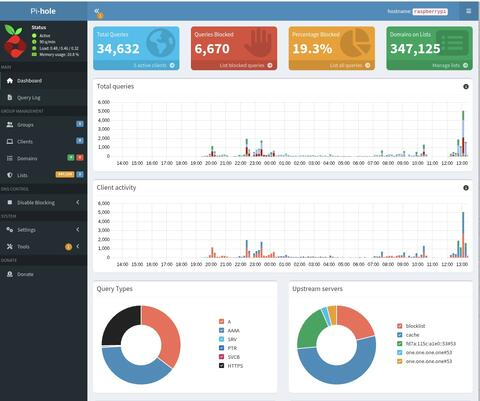
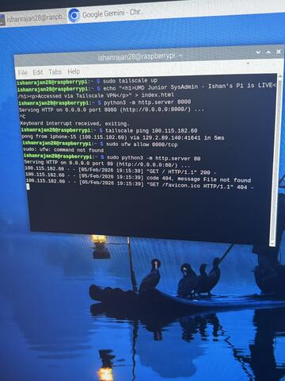

# Secure-Remote-DNS-Sinkhole-Mesh-VPN-Deployment (Project Aegis)

A production-ready private DNS sinkhole deployment leveraging a **Raspberry Pi** and **Tailscale Mesh VPN** to provide encrypted, ad-filtered, and telemetry-free browsing across different network environments.

## Pi-hole Dashboard



_Figure: Pi-hole administrative dashboard used for deep packet inspection of DNS traffic, Live Query Log auditing, and continuous blocklist refinement to balance device privacy and functional connectivity._

## CLI Verification



_Figure: Command-line validation of the Tailscale tunnel and cross-segment communication using a lightweight Python HTTP server bound to 0.0.0.0:8080 for end-to-end mobile device handshake testing._

## iPhone Results


_Figure: Verified peer-to-peer connectivity between an iPhone 15 and the Raspberry Pi over the encrypted Tailscale tunnel, confirming traffic routing through the mesh and a stable mobile-to-host handshake._

## Overview

This project solves a real problem I ran into: keeping privacy and network performance on restrictive Tier-1 academic and public networks. By routing DNS traffic through a hardened **Pi-hole** instance via a **Tailscale** overlay, the system cuts telemetry and bandwidth waste without needing complex firewall configs.

## Tech Stack

- **Hardware:** Raspberry Pi (Raspberry Pi OS / Debian)
- **Software:** Pi-hole (DNS Sinkhole), Tailscale (WireGuard-based Mesh VPN)
- **Database:** SQLite3 (Gravity DB management)
- **Protocols:** DNS, WireGuard, UDP (NAT Traversal)

## Key Features & Performance Metrics

- **Remote Ad-Blocking:** Seamless DNS-level filtering on mobile and desktop devices via global Tailscale exit nodes.
- **Restrictive Network Traversal:** Bypassed Symmetric NAT and aggressive firewalls on Tier-1 academic networks.
- **Efficacy:** Hit a consistent **40% block rate** on device egress traffic, effectively neutralizing background telemetry from OS and third-party SDKs.
- **Hardened Blocklists:** Integrated high-volume threat intelligence feeds (OISD Pro) via manual data entry, managing a database of **347,000+ records**.
- **Low Latency:** Optimized DNS resolution path to maintain sub-70ms RTT even when forced to fallback to DERP relaying.

## Architecture & Deployment

### 1. Mesh VPN Integration

The Raspberry Pi runs as a persistent node on a private Tailnet. **MagicDNS** and **Global Nameserver Override** are utilized to ensure all connected clients utilize the Pi-hole for resolution regardless of local DHCP settings.

### 2. Database Hardening

To go beyond Pi-hole's default filtering, I manually loaded ABP-style wildcard patterns directly into the SQLite3 backend:

```bash
# Manual database entry of OISD threat intelligence feed
sudo sqlite3 /etc/pihole/gravity.db "INSERT INTO adlist (address, enabled, comment) VALUES ('https://big.oisd.nl', 1, 'OISD Pro');"
pihole -g

```
